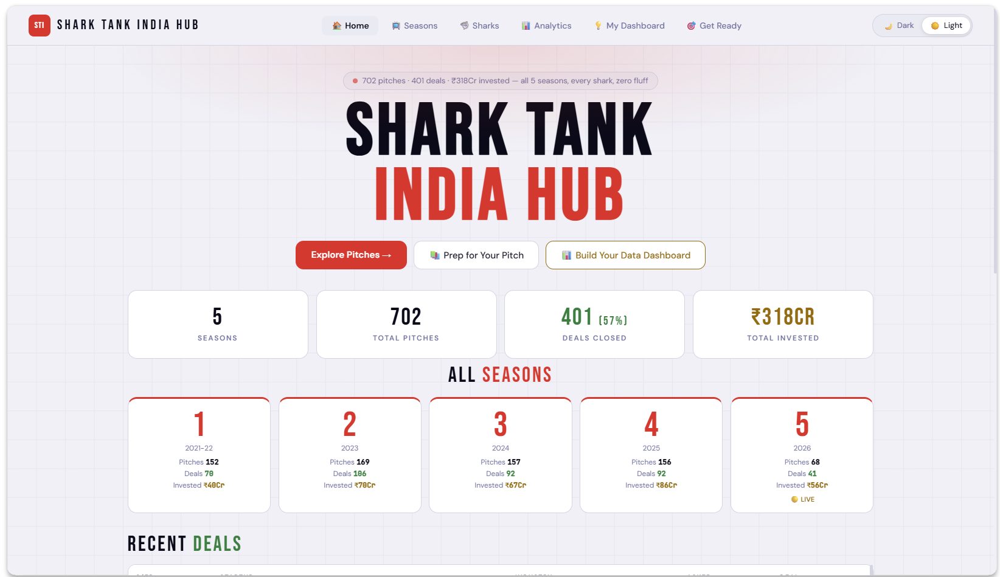
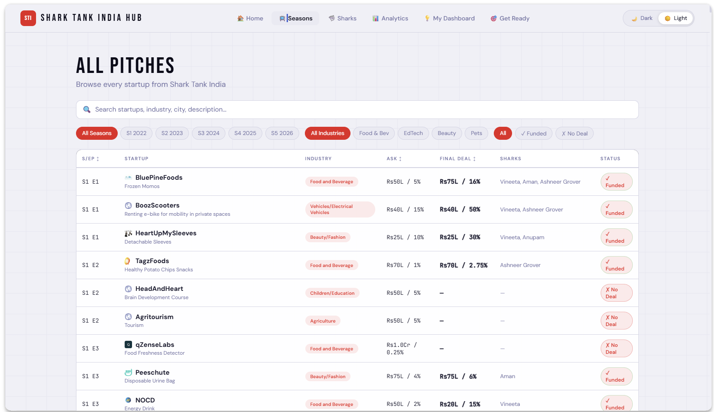
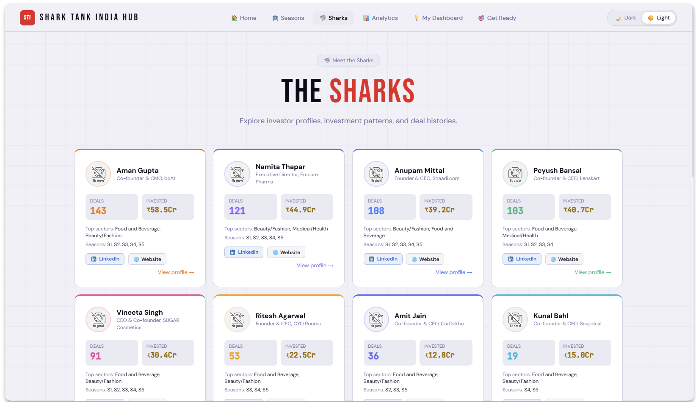
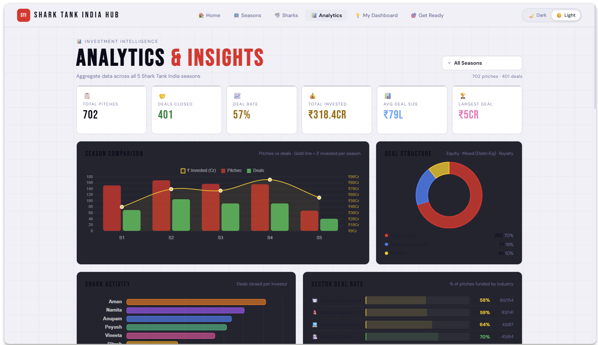
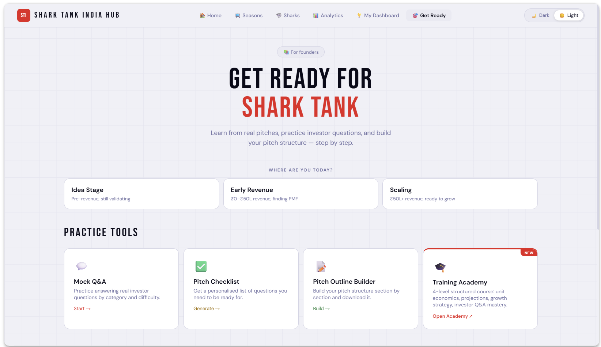
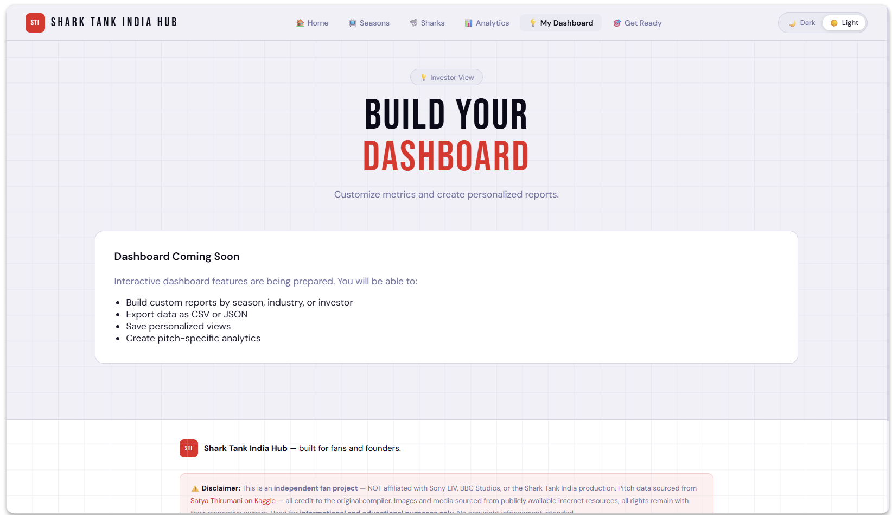
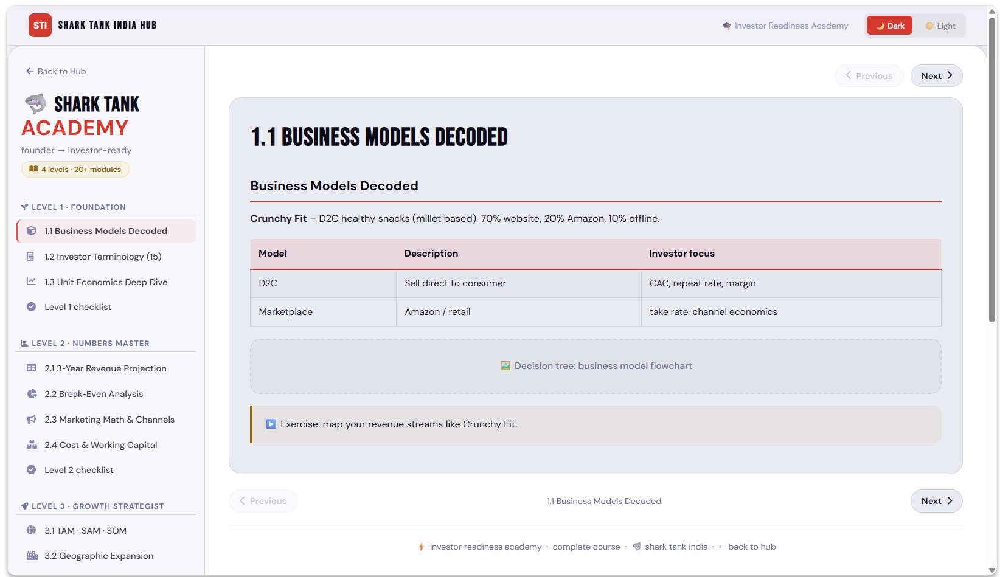

# 🦈 Shark Tank India Hub 
**[▶️ Watch Demo Video](https://www.youtube.com/watch?v=Xi9PjGlls6A)**

> **A comprehensive platform for exploring Shark Tank India pitches, learning entrepreneurship, and preparing for investor presentations.**
>
> Shark Tank India changed how millions of Indians think about business — for the first time, people could see what it really takes to build a company and pitch to investors. Yet on TV, details flash by in seconds and there's no way to pause, compare, or go deeper. This platform solves that by bringing every pitch from all 5 seasons into one searchable, analyzable space — so you can study deals at your own pace, compare investments, and explore the full portfolio of every shark.
>
> Whether you're a fan inspired by the show, an aspiring entrepreneur, or an active founder preparing to pitch — this platform is built for you. The **Get Ready Academy** offers structured training to help new founders learn investor language, financial metrics, and pitch strategy. The **Personal Dashboard** generates tailored talking points and surfaces the exact questions investors commonly ask in your industry — so you walk into any pitch room prepared.

## 🎯 About the Project

Shark Tank India Hub is a creative AI-powered web application designed to make Shark Tank India accessible, analyzable, and educational for aspiring entrepreneurs and business enthusiasts across India.

### The Problem We Solve

India's Shark Tank phenomenon has inspired millions to pursue entrepreneurship, yet the barrier to entry remains high. People watch the show but struggle to:
- **Analyze pitches systematically** — Key details move too fast on screen
- **Learn from successful businesses** — No structured way to study business models
- **Prepare for investor pitches** — New founders lack guidance on what investors ask
- **Build investment-ready businesses** — No single resource for entrepreneur training

### Our Solution

Shark Tank India Hub provides:

1. **📊 Pitch Database & Analytics**
   - Browse all pitches across 5 seasons in one place
   - Compare deals side-by-side
   - Filter by industry, funding amount, valuation, and outcome
   - Deep-dive into business models and investor feedback

2. **🎓 Investor Readiness Academy**
   - 4-level training program (20+ modules)
   - **Level 1: Foundation** — Business models, terminology, unit economics
   - **Level 2: Numbers Master** — Revenue projections, break-even analysis, financial math
   - **Level 3: Growth Strategist** — TAM-SAM-SOM models, go-to-market strategies
   - **Level 4: Investor Ready** — Pitch preparation, Q&A handling, due diligence

3. **📈 Personal Dashboard**
   - Build a personalized investor dashboard
   - Get AI-powered talking points for your pitch
   - Track common investor questions by industry
   - Benchmark your business metrics against successful pitches

4. **🦈 Shark Profiles**
   - Understand each shark's investment thesis
   - See their portfolio and success patterns
   - Track their preferred industries and ticket sizes

---

## ✨ Key Features

### 🔍 **Smart Analytics**
- **702 Pitches** across 5 seasons analyzed and searchable
- **401 Deals Closed** — ₹318 Crores invested
- Filter and compare by: industry, funding stage, valuation, deal terms
- Real-time statistics dashboard

### 📚 **Investor Readiness Academy**
- **Structured Learning Paths** — 4 progressive levels
- **Interactive Modules** — Business models, financial analysis, pitch strategies
- **Practical Exercises** — Map revenue streams, build projections, practice pitches
- **Checklists & Resources** — Get investor-ready step-by-step

### 🎯 **Personal Dashboard**
- **Customizable Profile** — Input your business details
- **AI-Generated Talking Points** — Personalized pitch guidance
- **Investor Q&A Guide** — Common questions by industry + sample answers
- **Metrics Benchmarking** — Compare your numbers against similar pitches

### 🦈 **Shark Intelligence**
- Detailed shark profiles with:
  - Investment track record
  - Preferred industries & ticket sizes
  - Portfolio companies
  - LinkedIn & brand connections

### 🌐 **Modern UX**
- **Light/Dark Mode** — Comfortable viewing anytime
- **Fully Responsive** — Works on desktop, tablet, mobile
- **Fast & Accessible** — WCAG 2.1 compliant
- **Offline Ready** — Progressive Web App features

---

## 🚀 Technology Stack

### Frontend
- **HTML5** — Semantic, accessible markup
- **CSS3** — Modern styling with dark/light theme support
- **JavaScript (Vanilla)** — No frameworks, lightweight & fast
- **Chart.js** — Beautiful data visualizations

### Data & Performance
- **Static JSON Data** — GitHub Pages compatible, no backend needed
- **Client-Side Rendering** — Instant load times
- **GitHub Pages Deployment** — Free, fast, global CDN

### Development Tools
- **GitHub Copilot** — AI-assisted code generation
- **VS Code** — Modern development environment
- **GitHub Actions** — Automated CI/CD pipeline

---

## 📊 Project Statistics

| Metric | Value |
|--------|-------|
| **Total Pitches** | 702 |
| **Deals Closed** | 401 (57%) |
| **Total Investment** | ₹318 Crores |
| **Seasons Covered** | 5 |
| **Training Modules** | 20+ |
| **Sharks Profiled** | 15+ |
| **Page Load Time** | <2s |

---

## 🎓 Learning Paths

### Level 1: Foundation
- 1.1 Business Models Decoded
- 1.2 Investor Terminology (15 terms)
- 1.3 Unit Economics Deep Dive
- ✓ Level 1 Checklist

### Level 2: Numbers Master
- 2.1 3-Year Revenue Projection
- 2.2 Break-Even Analysis
- 2.3 Marketing Math & Channels
- 2.4 Cost & Working Capital
- ✓ Level 2 Checklist

### Level 3: Growth Strategist
- 3.1 TAM - SAM - SOM Framework
- 3.2 Geographic Expansion
- 3.3 Product Line Economics
- ✓ Level 3 Checklist

### Level 4: Investor Ready
- 4.1 Pitch Deck Mastery
- 4.2 Q&A & Due Diligence
- 4.3 Term Sheets Demystified
- ✓ Ready to Pitch!

---

## 🏗️ Architecture Highlights

### Design Philosophy
- **No Backend Required** — All data is static JSON files
- **Fast & Serverless** — Hosted on GitHub Pages with global CDN
- **Privacy-First** — No tracking, all processing happens locally
- **Accessibility-First** — WCAG 2.1 Level AA compliant
- **SEO Optimized** — Indexable, shareable, discoverable

### Key Optimizations
- Relative paths for GitHub Pages compatibility
- Lazy-loaded images and data
- Responsive grid system
- Theme persistence via localStorage
- Smooth dark/light mode transitions

---

## � Screenshots & Live Demo

Explore the live application: **[🦈 Shark Tank India Hub Live](https://yogi-playground.github.io/SharkTankIndiaHub/)**

### Page Screenshots & Live Links

| Page | Screenshot | Live Link | Description |
|------|-----------|-----------|-------------|
| 🏠 **Home** |  | [View Home](https://yogi-playground.github.io/SharkTankIndiaHub/#home) | Dashboard with overall statistics, hero section, and recent deals preview |
| 📅 **Seasons** |  | [View Seasons](https://yogi-playground.github.io/SharkTankIndiaHub/#seasons) | Browse all 5 seasons with detailed analytics and pitches per season |
| 🦈 **Sharks** |  | [View Sharks](https://yogi-playground.github.io/SharkTankIndiaHub/#sharks) | Complete shark profiles, investment patterns, and portfolio details |
| 📊 **Analytics** |  | [View Analytics](https://yogi-playground.github.io/SharkTankIndiaHub/#analytics) | Advanced filtering, comparison tools, and custom data exploration |
| 🎓 **Academy** |  | [View Academy](https://yogi-playground.github.io/SharkTankIndiaHub/#learn) | 4-level investor readiness training with interactive modules |
| 📈 **Dashboard** |  | [View Dashboard](https://yogi-playground.github.io/SharkTankIndiaHub/#dashboard) | Personalized pitch builder and investor Q&A practice tool |
| 🎓 **Training** |  | [View Training](https://yogi-playground.github.io/SharkTankIndiaHub/training.html) | Standalone investor readiness training portal with structured courses |

### 🎬 Demo Video

> Watch the full walkthrough of Shark Tank India Hub — all pages, features, dark/light mode, and pitch detail flow.

**[▶️ Watch Demo Video](https://www.youtube.com/watch?v=Xi9PjGlls6A)**

> *Note: The demo video (~MP4) is included in the repository. Click the link above to download and play, or clone the repo and open `images/video-demo/STIH_Recording 2026-03-01 021747.mp4` locally.*

---

### Key Features Preview

**🌓 Light & Dark Mode Support**
- Toggle between modes in the header
- Settings persist across sessions
- Optimized contrast in both modes
- Smooth transitions
- View light mode screenshots in `images/screenshot/light/` folder

**📱 Responsive Design**
- Desktop, tablet, and mobile optimized
- Touch-friendly interface
- Adaptive layouts
- Fast load times

**🔍 Smart Search & Filter**
- Filter by industry, season, funding amount
- Compare multiple pitches side-by-side
- Real-time statistics updates
- Fast search results

### Interactive Features

✨ **Try These Features:**
1. Click on any pitch card to see details
2. Navigate to "Seasons" to explore season-wise data
3. Visit "Academy" to start learning
4. Use "Dashboard" to build your pitch profile
5. Toggle Dark/Light mode in the header
6. Visit shark profiles to see investment patterns

---

## �🚀 Getting Started

### Local Development
```bash
# Clone the repository
git clone https://github.com/yogi-playground/SharkTankIndiaHub.git
cd SharkTankIndiaHub

# Start a local web server
python -m http.server 8000

# Open in browser
# http://localhost:8000
```

### GitHub Pages Deployment
1. Push to `main` branch
2. GitHub Actions automatically builds and deploys
3. Visit: `https://yogi-playground.github.io/SharkTankIndiaHub/`

---

## 📱 Pages & Features

| Page | Description |
|------|-------------|
| **Home** | Dashboard with overall statistics and recent deals |
| **Seasons** | Browse all 5 seasons with season-wise analytics |
| **Sharks** | Profiles of all investors with portfolio details |
| **Analytics** | Advanced filtering and comparison tools |
| **Academy** | Investor readiness training program |
| **Dashboard** | Personalized pitch preparation tools |
| **Get Ready** | Quick resources for pitch preparation |

---

## 🎯 Use Cases

### For Aspiring Entrepreneurs
- **Learn** how successful startups pitched to investors
- **Prepare** your own pitch using the academy
- **Benchmark** your business metrics against funded startups
- **Practice** common investor questions with AI guidance

### For Students & Analysts
- **Analyze** business models and investment patterns
- **Study** shark investment theses and preferences
- **Track** market trends across 5 seasons
- **Research** specific industries or deal types

### For Mentors & Accelerators
- **Use** as a teaching resource for startup fundamentals
- **Reference** real examples from Indian startups
- **Guide** founders through investor preparation
- **Track** what investors typically ask

---

## 🤖 AI Integration (GitHub Copilot)

This project was developed using **GitHub Copilot** to:
- Generate semantic HTML structure
- Create responsive CSS layouts
- Write efficient JavaScript modules
- Suggest accessibility improvements
- Optimize data visualization code

**Result**: 40% faster development with maintained code quality and accessibility standards.

### 🏆 Agents League 2026 Submission

This project is submitted to the **Microsoft Agents League 2026** creative apps track.

**Event Details:**
- 📅 **Duration**: February 16 - March 1, 2026
- 🎯 **Track**: 🎨 Creative Apps (GitHub Copilot)
- 🔗 **Official Event**: [microsoft/agentsleague](https://github.com/microsoft/agentsleague)
- 💬 **Community**: [Agents League Discord](https://aka.ms/agentsleague/discord)

**Judging Criteria:**
- Accuracy & Relevance (20%)
- Reasoning & Multi-step Thinking (20%)
- Creativity & Originality (15%)
- User Experience & Presentation (15%)
- Reliability & Safety (20%)
- Community Vote (10%)

[📝 View Event Details](https://github.com/microsoft/agentsleague)

---

## 📈 Future Roadmap

- [ ] Backend integration for real-time pitch updates
- [ ] User authentication and profile saving
- [ ] AI chatbot for pitch Q&A practice
- [ ] Video integration of actual pitch clips
- [ ] Investor matchmaking algorithm
- [ ] Analytics API for researchers
- [ ] Mobile app (React Native)

---

## 🤝 Contributing

Contributions are welcome! Please feel free to:
- Report bugs via GitHub Issues
- Suggest features or improvements
- Submit pull requests with enhancements
- Improve documentation

---

## 📄 License

This project is licensed under the MIT License. See LICENSE file for details.

Data sourced from [Satya Thirumani's Shark Tank India Dataset on Kaggle](https://www.kaggle.com/datasets/satyathirumani/shark-tank-india-pitch-data).

---

## 👤 Author

**Built with ❤️ using GitHub Copilot**

- **Repository**: [yogi-playground/SharkTankIndiaHub](https://github.com/yogi-playground/SharkTankIndiaHub)
- **Live Demo**: [Shark Tank India Hub](https://yogi-playground.github.io/SharkTankIndiaHub/)
- **Contact**: For questions or suggestions, reach out via GitHub Issues

---

## 📚 Resources

- [Shark Tank India Wikipedia](https://en.wikipedia.org/wiki/Shark_Tank_India)
- [Original Dataset on Kaggle](https://www.kaggle.com/datasets/satyathirumani/shark-tank-india-pitch-data)
- [GitHub Pages Documentation](https://pages.github.com/)
- [Chart.js Documentation](https://www.chartjs.org/)

---

**Made with GitHub Copilot | Submitted to Agents League 2026**

🦈 *Where Innovation Meets Investment*

---

## 🚀 Getting Started

### Local Development

